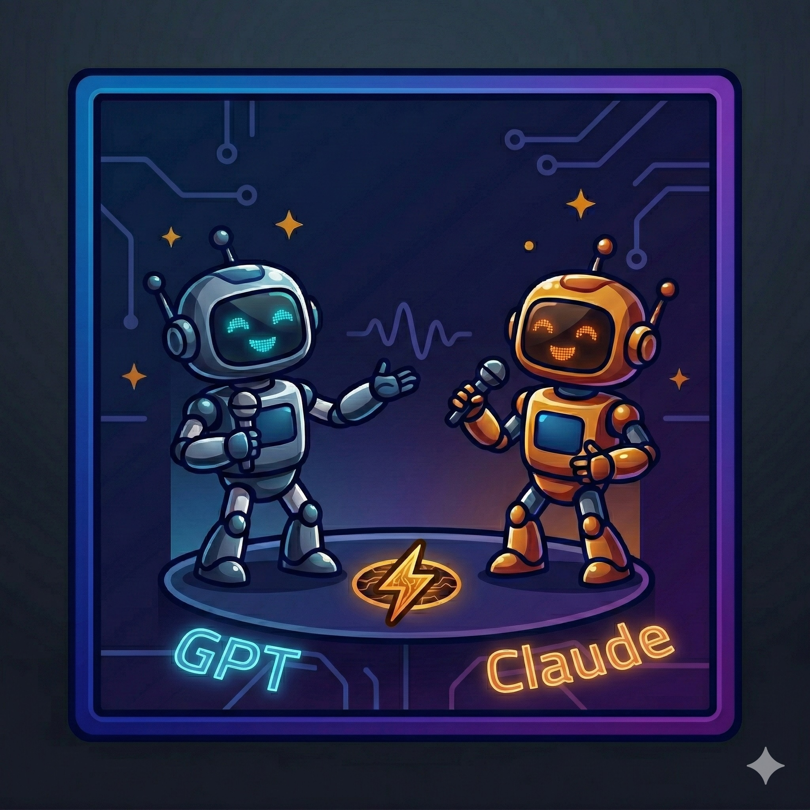

# LLM Debate



A web app that pits two LLMs against each other in a structured debate. Pick a topic, assign each model a point of view, and watch them argue it out turn by turn — with an optional judge model to score the result.

<video src="assets/demo.mp4" controls width="100%"></video>

## How It Works

1. **Setup** — Enter a debate topic (or let the AI suggest one), pick two models from OpenRouter, and assign each a point of view.
2. **Debate** — The models argue back and forth for a configurable number of turns, streamed live to the UI.
3. **Judge** (optional) — A third model evaluates the debate and declares a winner with a report card.

Responses are streamed token-by-token so you see the debate unfold in real time.

## Project Structure

```
llm-debate/
├── backend/              # FastAPI backend (Python)
│   ├── main.py           # API routes and SSE streaming
│   ├── debate.py         # Debate logic, POV generation, judge
│   ├── openrouter.py     # OpenRouter API client
│   ├── storage.py        # JSON-based persistence (data/conversations/)
│   ├── models.py         # Model validation
│   └── config.py         # Loads config.json and environment variables
├── frontend/             # React + Vite frontend
│   └── src/
│       ├── App.jsx
│       ├── api.js
│       └── components/
│           ├── DebateSetup.jsx   # Topic + model selection
│           ├── DebateView.jsx    # Live debate stream
│           ├── JudgeReport.jsx   # Judge verdict display
│           └── Sidebar.jsx       # Conversation history
├── data/conversations/   # Stored debates (auto-created)
├── config.json           # Default model and turn settings
├── Makefile              # Start/stop shortcuts
└── .env                  # API key (not committed)
```

## Prerequisites

- **[uv](https://docs.astral.sh/uv/)** — Python package and project manager
- **Node.js 18+** and npm
- An **[OpenRouter](https://openrouter.ai) API key**

Install uv if you don't have it:

```bash
curl -LsSf https://astral.sh/uv/install.sh | sh
```

## Setup

### 1. Clone and install dependencies

```bash
# Backend — uv creates the venv and installs everything from pyproject.toml
uv sync

# Frontend
cd frontend && npm install
```

### 2. Configure your API key

Create a `.env` file in the project root:

```
OPENROUTER_API_KEY=your_key_here
```

### 3. (Optional) Adjust defaults in `config.json`

```json
{
  "pov_generator_model": "anthropic/claude-sonnet-4-5",
  "default_max_turns": 5
}
```

- `pov_generator_model` — model used to auto-generate debate topics and points of view
- `default_max_turns` — number of rounds (each turn = both models speak once)

## Starting the App

Use the Makefile to start both services in the background:

```bash
make start     # start backend + frontend
make stop      # stop both
make restart   # stop then start
```

Or start them individually:

```bash
make backend   # backend only  → http://localhost:8001
make frontend  # frontend only → http://localhost:5173
```

Logs are written to `.logs/backend.log` and `.logs/frontend.log`.

To run the backend manually (from the project root):

```bash
uv run python -m backend.main
```

## API

The backend exposes a REST API at `http://localhost:8001`:

| Method | Path | Description |
|--------|------|-------------|
| `POST` | `/api/generate-povs` | Generate opposing POVs for a topic |
| `POST` | `/api/debates` | Create a new debate |
| `POST` | `/api/debates/{id}/start` | Stream the debate (SSE) |
| `POST` | `/api/debates/{id}/judge` | Run the judge model |
| `GET` | `/api/debates` | List all past debates |
| `GET` | `/api/debates/{id}` | Get a specific debate |
| `DELETE` | `/api/debates/{id}` | Delete a debate |

## Model Selection

Any model available on [OpenRouter](https://openrouter.ai/models) can be used. Use the full `provider/model-name` identifier (e.g. `openai/gpt-4o`, `anthropic/claude-sonnet-4-5`, `google/gemini-2.0-flash-001`).

The two debater models and the optional judge model can all be different.
